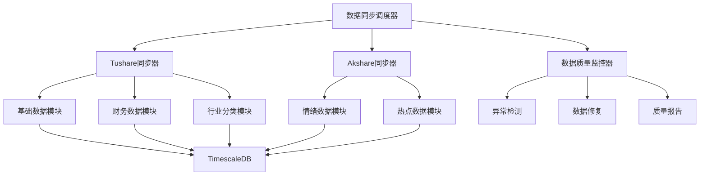

# 数据同步增强功能设计文档

## 概述

本设计文档描述了StockSchool系统数据同步增强功能的技术架构和实现方案，重点解决多数据源集成、增量更新优化和数据质量保障等关键问题。

## 架构设计

### 整体架构



### 核心组件

#### 1. 数据同步调度器 (DataSyncScheduler)
- **职责**: 协调多数据源同步，管理同步状态
- **接口**: 
  - `schedule_sync(data_sources: List[str], sync_type: str)`
  - `get_sync_status() -> Dict[str, Any]`
  - `cancel_sync(sync_id: str)`

#### 2. Akshare同步器 (AkshareSynchronizer)
- **职责**: 处理Akshare数据源的情绪面数据获取
- **接口**:
  - `sync_sentiment_data(date_range: Tuple[str, str])`
  - `sync_attention_data(stock_codes: List[str])`
  - `sync_popularity_ranking()`

#### 3. 行业分类管理器 (IndustryClassificationManager)
- **职责**: 管理申万行业分类数据的同步和维护
- **接口**:
  - `sync_industry_classification(level: str)`
  - `update_stock_industry_mapping()`
  - `get_industry_history(ts_code: str, date: str)`

## 数据模型设计

### 情绪数据表结构

```sql
-- 新闻情绪数据表
CREATE TABLE news_sentiment (
    id UUID DEFAULT uuid_generate_v4() PRIMARY KEY,
    ts_code VARCHAR(20) NOT NULL,
    news_date DATE NOT NULL,
    sentiment_score DECIMAL(5,4),  -- 情绪分数 -1到1
    positive_count INTEGER,
    negative_count INTEGER,
    neutral_count INTEGER,
    news_volume INTEGER,
    created_at TIMESTAMP DEFAULT CURRENT_TIMESTAMP,
    UNIQUE(ts_code, news_date)
);

-- 用户关注度数据表
CREATE TABLE user_attention (
    id UUID DEFAULT uuid_generate_v4() PRIMARY KEY,
    ts_code VARCHAR(20) NOT NULL,
    attention_date DATE NOT NULL,
    attention_score DECIMAL(8,4),  -- 关注度分数
    search_volume INTEGER,
    discussion_volume INTEGER,
    created_at TIMESTAMP DEFAULT CURRENT_TIMESTAMP,
    UNIQUE(ts_code, attention_date)
);

-- 人气榜数据表
CREATE TABLE popularity_ranking (
    id UUID DEFAULT uuid_generate_v4() PRIMARY KEY,
    ts_code VARCHAR(20) NOT NULL,
    ranking_date DATE NOT NULL,
    ranking_type VARCHAR(20),  -- 'hot', 'active', 'attention'
    rank_position INTEGER,
    popularity_score DECIMAL(8,4),
    created_at TIMESTAMP DEFAULT CURRENT_TIMESTAMP,
    UNIQUE(ts_code, ranking_date, ranking_type)
);
```

### 同步状态管理表

```sql
-- 数据同步状态表
CREATE TABLE sync_status (
    id UUID DEFAULT uuid_generate_v4() PRIMARY KEY,
    data_source VARCHAR(50) NOT NULL,  -- 'tushare', 'akshare'
    data_type VARCHAR(50) NOT NULL,    -- 'daily', 'financial', 'sentiment'
    last_sync_date DATE,
    last_sync_time TIMESTAMP,
    sync_status VARCHAR(20),           -- 'success', 'failed', 'running'
    records_processed INTEGER,
    error_message TEXT,
    created_at TIMESTAMP DEFAULT CURRENT_TIMESTAMP,
    updated_at TIMESTAMP DEFAULT CURRENT_TIMESTAMP,
    UNIQUE(data_source, data_type)
);
```

## 核心算法设计

### 增量更新算法

```python
class IncrementalUpdateManager:
    def __init__(self):
        self.engine = get_db_engine()
        
    def get_missing_dates(self, data_type: str, ts_code: str = None) -> List[str]:
        """获取需要更新的日期列表"""
        # 1. 从trade_calendar获取所有交易日
        # 2. 查询已存在的数据日期
        # 3. 返回缺失的日期列表
        
    def sync_incremental_data(self, data_source: str, missing_dates: List[str]):
        """执行增量数据同步"""
        for date in missing_dates:
            try:
                # 获取指定日期的数据
                data = self.fetch_data_by_date(data_source, date)
                # 使用UPSERT模式存储数据
                self.upsert_data(data)
                # 更新同步状态
                self.update_sync_status(data_source, date, 'success')
            except Exception as e:
                self.update_sync_status(data_source, date, 'failed', str(e))
```

### 数据质量检测算法

```python
class DataQualityChecker:
    def __init__(self):
        self.outlier_threshold = 3  # 3σ原则
        
    def detect_price_anomalies(self, data: pd.DataFrame) -> pd.DataFrame:
        """检测价格异常"""
        anomalies = []
        
        # 检查价格逻辑异常
        logical_errors = data[
            (data['high'] < data['low']) |
            (data['open'] < 0) |
            (data['close'] < 0) |
            (data['high'] / data['low'] > 1.2)  # 单日涨跌幅超过20%
        ]
        
        # 检查统计异常
        for column in ['open', 'high', 'low', 'close']:
            mean_val = data[column].mean()
            std_val = data[column].std()
            statistical_errors = data[
                abs(data[column] - mean_val) > self.outlier_threshold * std_val
            ]
            anomalies.append(statistical_errors)
            
        return pd.concat(anomalies).drop_duplicates()
    
    def fill_missing_values(self, data: pd.DataFrame) -> pd.DataFrame:
        """填充缺失值"""
        # 前向填充
        data_filled = data.fillna(method='ffill')
        
        # 行业均值填充
        if 'industry' in data.columns:
            industry_means = data.groupby('industry').transform('mean')
            data_filled = data_filled.fillna(industry_means)
            
        return data_filled
```

## 接口设计

### REST API接口

```python
from fastapi import APIRouter, HTTPException
from typing import List, Optional

router = APIRouter(prefix="/api/v1/sync")

@router.post("/start")
async def start_sync(
    data_sources: List[str],
    sync_type: str = "incremental",
    date_range: Optional[Tuple[str, str]] = None
):
    """启动数据同步"""
    
@router.get("/status")
async def get_sync_status():
    """获取同步状态"""
    
@router.get("/quality-report")
async def get_quality_report(
    start_date: str,
    end_date: str
):
    """获取数据质量报告"""
```

### 配置接口

```yaml
# config/data_sync.yml
data_sources:
  tushare:
    enabled: true
    api_limit: 200  # 每分钟调用限制
    retry_times: 3
    retry_delay: 1
    
  akshare:
    enabled: true
    api_limit: 100
    retry_times: 3
    retry_delay: 2

sync_strategy:
  incremental:
    enabled: true
    check_interval: 3600  # 1小时检查一次
    
  full:
    enabled: true
    schedule: "0 2 * * 0"  # 每周日凌晨2点全量同步

data_quality:
  outlier_detection:
    enabled: true
    threshold: 3  # 3σ原则
    
  missing_value_handling:
    method: "forward_fill_industry_mean"
    
  anomaly_alert:
    enabled: true
    webhook_url: "${ALERT_WEBHOOK_URL}"
```

## 错误处理和监控

### 错误分类和处理策略

1. **网络错误**: 自动重试，指数退避
2. **API限制错误**: 等待后重试
3. **数据格式错误**: 记录日志，跳过错误数据
4. **数据库错误**: 事务回滚，告警通知

### 监控指标

- 同步成功率
- 数据延迟时间
- 异常数据比例
- API调用频率
- 数据库性能指标

## 测试策略

### 单元测试
- 各同步器的数据获取功能
- 数据质量检测算法
- 增量更新逻辑

### 集成测试
- 多数据源协调同步
- 数据库事务处理
- 错误恢复机制

### 性能测试
- 大批量数据同步性能
- 并发同步能力
- 内存使用优化