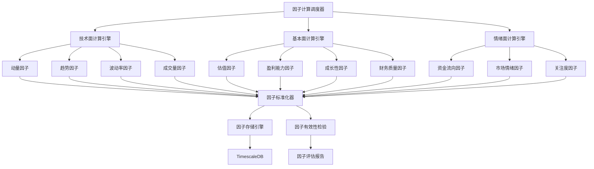

# 因子计算引擎设计文档

## 概述

本设计文档描述了StockSchool系统因子计算引擎的技术架构，实现技术面、基本面、情绪面三大因子计算体系，并提供因子标准化、有效性检验和任务调度等功能。

## 架构设计

### 整体架构



### 核心组件设计

#### 1. 因子计算调度器 (FactorCalculationScheduler)

```python
class FactorCalculationScheduler:
    """因子计算任务调度器"""
    
    def __init__(self):
        self.task_queue = PriorityQueue()
        self.worker_pool = ThreadPoolExecutor(max_workers=4)
        self.dependency_graph = FactorDependencyGraph()
    
    def schedule_factor_calculation(self, factor_types: List[str], date: str):
        """调度因子计算任务"""
        
    def get_calculation_status(self) -> Dict[str, Any]:
        """获取计算状态"""
        
    def retry_failed_tasks(self):
        """重试失败的任务"""
```

#### 2. 技术面计算引擎 (TechnicalFactorEngine)

```python
class TechnicalFactorEngine:
    """技术面因子计算引擎"""
    
    def calculate_momentum_factors(self, data: pd.DataFrame) -> pd.DataFrame:
        """计算动量因子"""
        
    def calculate_trend_factors(self, data: pd.DataFrame) -> pd.DataFrame:
        """计算趋势因子"""
        
    def calculate_volatility_factors(self, data: pd.DataFrame) -> pd.DataFrame:
        """计算波动率因子"""
        
    def calculate_volume_factors(self, data: pd.DataFrame) -> pd.DataFrame:
        """计算成交量因子"""
```

#### 3. 基本面计算引擎 (FundamentalFactorEngine)

```python
class FundamentalFactorEngine:
    """基本面因子计算引擎"""
    
    def calculate_valuation_factors(self, financial_data: pd.DataFrame, 
                                  market_data: pd.DataFrame) -> pd.DataFrame:
        """计算估值因子"""
        
    def calculate_profitability_factors(self, financial_data: pd.DataFrame) -> pd.DataFrame:
        """计算盈利能力因子"""
        
    def calculate_growth_factors(self, financial_data: pd.DataFrame) -> pd.DataFrame:
        """计算成长性因子"""
        
    def calculate_quality_factors(self, financial_data: pd.DataFrame) -> pd.DataFrame:
        """计算财务质量因子"""
```

## 数据模型设计

### 因子数据存储结构

```sql
-- 因子主表（宽表设计）
CREATE TABLE stock_factors_wide (
    ts_code VARCHAR(20) NOT NULL,
    trade_date DATE NOT NULL,
    
    -- 技术面因子
    rsi_14 DECIMAL(8,4),
    rsi_6 DECIMAL(8,4),
    macd DECIMAL(8,4),
    macd_signal DECIMAL(8,4),
    macd_histogram DECIMAL(8,4),
    bb_upper DECIMAL(10,3),
    bb_middle DECIMAL(10,3),
    bb_lower DECIMAL(10,3),
    bb_width DECIMAL(8,4),
    atr_14 DECIMAL(8,4),
    momentum_5 DECIMAL(8,4),
    momentum_10 DECIMAL(8,4),
    momentum_20 DECIMAL(8,4),
    
    -- 基本面因子
    pe_ratio DECIMAL(8,4),
    pb_ratio DECIMAL(8,4),
    ps_ratio DECIMAL(8,4),
    roe DECIMAL(8,4),
    roa DECIMAL(8,4),
    gross_margin DECIMAL(8,4),
    net_margin DECIMAL(8,4),
    revenue_growth_yoy DECIMAL(8,4),
    profit_growth_yoy DECIMAL(8,4),
    debt_to_equity DECIMAL(8,4),
    current_ratio DECIMAL(8,4),
    
    -- 情绪面因子
    money_flow_5 DECIMAL(8,4),
    money_flow_20 DECIMAL(8,4),
    attention_score DECIMAL(8,4),
    sentiment_score DECIMAL(8,4),
    turnover_rate_ma DECIMAL(8,4),
    
    created_at TIMESTAMP DEFAULT CURRENT_TIMESTAMP,
    updated_at TIMESTAMP DEFAULT CURRENT_TIMESTAMP,
    
    PRIMARY KEY (ts_code, trade_date)
);

-- 创建时序超表
SELECT create_hypertable('stock_factors_wide', 'trade_date', if_not_exists => TRUE);

-- 因子标准化数据表
CREATE TABLE factor_standardized (
    ts_code VARCHAR(20) NOT NULL,
    trade_date DATE NOT NULL,
    factor_name VARCHAR(50) NOT NULL,
    raw_value DECIMAL(12,6),
    z_score DECIMAL(8,4),
    percentile_rank DECIMAL(8,4),
    industry_z_score DECIMAL(8,4),
    industry_percentile DECIMAL(8,4),
    created_at TIMESTAMP DEFAULT CURRENT_TIMESTAMP,
    
    PRIMARY KEY (ts_code, trade_date, factor_name)
);

-- 因子有效性统计表
CREATE TABLE factor_effectiveness (
    factor_name VARCHAR(50) NOT NULL,
    stat_date DATE NOT NULL,
    ic_1d DECIMAL(8,4),      -- 1日IC
    ic_5d DECIMAL(8,4),      -- 5日IC
    ic_20d DECIMAL(8,4),     -- 20日IC
    ir_1d DECIMAL(8,4),      -- 1日IR
    ir_5d DECIMAL(8,4),      -- 5日IR
    ir_20d DECIMAL(8,4),     -- 20日IR
    coverage_rate DECIMAL(8,4), -- 覆盖率
    turnover_rate DECIMAL(8,4), -- 换手率
    created_at TIMESTAMP DEFAULT CURRENT_TIMESTAMP,
    
    PRIMARY KEY (factor_name, stat_date)
);
```

## 核心算法实现

### 技术面因子计算

```python
class TechnicalIndicators:
    """技术指标计算类"""
    
    @staticmethod
    def calculate_rsi(data: pd.DataFrame, window: int = 14) -> pd.Series:
        """计算RSI指标"""
        delta = data['close'].diff()
        gain = delta.where(delta > 0, 0)
        loss = -delta.where(delta < 0, 0)
        
        avg_gain = gain.rolling(window=window).mean()
        avg_loss = loss.rolling(window=window).mean()
        
        rs = avg_gain / avg_loss
        rsi = 100 - (100 / (1 + rs))
        
        return rsi
    
    @staticmethod
    def calculate_macd(data: pd.DataFrame, 
                      fast_period: int = 12, 
                      slow_period: int = 26, 
                      signal_period: int = 9) -> pd.DataFrame:
        """计算MACD指标"""
        ema_fast = data['close'].ewm(span=fast_period).mean()
        ema_slow = data['close'].ewm(span=slow_period).mean()
        
        macd_line = ema_fast - ema_slow
        signal_line = macd_line.ewm(span=signal_period).mean()
        histogram = macd_line - signal_line
        
        return pd.DataFrame({
            'macd': macd_line,
            'signal': signal_line,
            'histogram': histogram
        })
    
    @staticmethod
    def calculate_bollinger_bands(data: pd.DataFrame, 
                                window: int = 20, 
                                num_std: float = 2) -> pd.DataFrame:
        """计算布林带"""
        sma = data['close'].rolling(window=window).mean()
        std = data['close'].rolling(window=window).std()
        
        upper_band = sma + (std * num_std)
        lower_band = sma - (std * num_std)
        width = (upper_band - lower_band) / sma
        
        return pd.DataFrame({
            'bb_upper': upper_band,
            'bb_middle': sma,
            'bb_lower': lower_band,
            'bb_width': width
        })
```

### 基本面因子计算

```python
class FundamentalIndicators:
    """基本面指标计算类"""
    
    @staticmethod
    def calculate_valuation_factors(financial_data: pd.DataFrame, 
                                  market_data: pd.DataFrame) -> pd.DataFrame:
        """计算估值因子"""
        # 合并财务数据和市场数据
        merged_data = pd.merge(financial_data, market_data, 
                              on=['ts_code', 'trade_date'], how='inner')
        
        # 计算PE比率
        merged_data['pe_ratio'] = merged_data['market_cap'] / merged_data['net_profit']
        
        # 计算PB比率
        merged_data['pb_ratio'] = merged_data['market_cap'] / merged_data['total_equity']
        
        # 计算PS比率
        merged_data['ps_ratio'] = merged_data['market_cap'] / merged_data['revenue']
        
        return merged_data[['ts_code', 'trade_date', 'pe_ratio', 'pb_ratio', 'ps_ratio']]
    
    @staticmethod
    def calculate_profitability_factors(financial_data: pd.DataFrame) -> pd.DataFrame:
        """计算盈利能力因子"""
        result = financial_data.copy()
        
        # ROE = 净利润 / 股东权益
        result['roe'] = result['net_profit'] / result['total_equity']
        
        # ROA = 净利润 / 总资产
        result['roa'] = result['net_profit'] / result['total_assets']
        
        # 毛利率 = (营收 - 营业成本) / 营收
        result['gross_margin'] = (result['revenue'] - result['cost_of_sales']) / result['revenue']
        
        # 净利率 = 净利润 / 营收
        result['net_margin'] = result['net_profit'] / result['revenue']
        
        return result[['ts_code', 'trade_date', 'roe', 'roa', 'gross_margin', 'net_margin']]
```

### 因子标准化算法

```python
class FactorStandardizer:
    """因子标准化处理类"""
    
    def __init__(self, method: str = 'zscore'):
        self.method = method
    
    def standardize_factors(self, factor_data: pd.DataFrame, 
                          industry_data: pd.DataFrame = None) -> pd.DataFrame:
        """标准化因子数据"""
        result = factor_data.copy()
        
        for factor_name in factor_data.columns:
            if factor_name in ['ts_code', 'trade_date']:
                continue
                
            # 全市场标准化
            result[f'{factor_name}_zscore'] = self._zscore_normalize(
                factor_data[factor_name]
            )
            result[f'{factor_name}_percentile'] = self._percentile_rank(
                factor_data[factor_name]
            )
            
            # 行业内标准化
            if industry_data is not None:
                result[f'{factor_name}_industry_zscore'] = self._industry_normalize(
                    factor_data, factor_name, industry_data
                )
        
        return result
    
    def _zscore_normalize(self, series: pd.Series) -> pd.Series:
        """Z-score标准化"""
        return (series - series.mean()) / series.std()
    
    def _percentile_rank(self, series: pd.Series) -> pd.Series:
        """百分位排名"""
        return series.rank(pct=True)
    
    def _industry_normalize(self, factor_data: pd.DataFrame, 
                          factor_name: str, 
                          industry_data: pd.DataFrame) -> pd.Series:
        """行业内标准化"""
        merged = pd.merge(factor_data, industry_data, on='ts_code')
        
        def industry_zscore(group):
            return (group[factor_name] - group[factor_name].mean()) / group[factor_name].std()
        
        return merged.groupby('industry').apply(industry_zscore).reset_index(level=0, drop=True)
```

### 因子有效性检验

```python
class FactorEffectivenessAnalyzer:
    """因子有效性分析器"""
    
    def calculate_ic(self, factor_values: pd.Series, 
                    future_returns: pd.Series) -> float:
        """计算信息系数(IC)"""
        return factor_values.corr(future_returns, method='spearman')
    
    def calculate_ir(self, ic_series: pd.Series) -> float:
        """计算信息比率(IR)"""
        return ic_series.mean() / ic_series.std()
    
    def factor_layered_backtest(self, factor_data: pd.DataFrame, 
                              return_data: pd.DataFrame, 
                              n_layers: int = 5) -> pd.DataFrame:
        """因子分层回测"""
        merged_data = pd.merge(factor_data, return_data, 
                              on=['ts_code', 'trade_date'])
        
        # 按因子值分层
        merged_data['factor_layer'] = pd.qcut(
            merged_data['factor_value'], 
            q=n_layers, 
            labels=range(1, n_layers + 1)
        )
        
        # 计算各层收益
        layer_returns = merged_data.groupby(['trade_date', 'factor_layer'])['return'].mean()
        
        return layer_returns.unstack(level='factor_layer')
```

## 性能优化策略

### 1. 并行计算优化

```python
from concurrent.futures import ProcessPoolExecutor
import multiprocessing as mp

class ParallelFactorCalculator:
    """并行因子计算器"""
    
    def __init__(self, n_workers: int = None):
        self.n_workers = n_workers or mp.cpu_count()
    
    def calculate_factors_parallel(self, stock_list: List[str], 
                                 calculation_date: str) -> pd.DataFrame:
        """并行计算多只股票的因子"""
        with ProcessPoolExecutor(max_workers=self.n_workers) as executor:
            futures = [
                executor.submit(self._calculate_single_stock_factors, stock, calculation_date)
                for stock in stock_list
            ]
            
            results = []
            for future in futures:
                try:
                    result = future.result(timeout=300)  # 5分钟超时
                    results.append(result)
                except Exception as e:
                    logger.error(f"因子计算失败: {e}")
                    
        return pd.concat(results, ignore_index=True)
```

### 2. 缓存机制

```python
from functools import lru_cache
import redis

class FactorCache:
    """因子计算缓存"""
    
    def __init__(self):
        self.redis_client = redis.Redis(host='localhost', port=6379, db=0)
        self.cache_ttl = 3600  # 1小时
    
    @lru_cache(maxsize=1000)
    def get_cached_factor(self, ts_code: str, factor_name: str, date: str):
        """获取缓存的因子值"""
        cache_key = f"factor:{ts_code}:{factor_name}:{date}"
        cached_value = self.redis_client.get(cache_key)
        
        if cached_value:
            return float(cached_value)
        return None
    
    def set_cached_factor(self, ts_code: str, factor_name: str, 
                         date: str, value: float):
        """设置因子缓存"""
        cache_key = f"factor:{ts_code}:{factor_name}:{date}"
        self.redis_client.setex(cache_key, self.cache_ttl, str(value))
```

## 监控和告警

### 计算状态监控

```python
class FactorCalculationMonitor:
    """因子计算监控器"""
    
    def __init__(self):
        self.metrics = {
            'total_calculations': 0,
            'successful_calculations': 0,
            'failed_calculations': 0,
            'average_calculation_time': 0,
            'last_calculation_time': None
        }
    
    def record_calculation_result(self, success: bool, duration: float):
        """记录计算结果"""
        self.metrics['total_calculations'] += 1
        
        if success:
            self.metrics['successful_calculations'] += 1
        else:
            self.metrics['failed_calculations'] += 1
            
        # 更新平均计算时间
        self._update_average_time(duration)
        self.metrics['last_calculation_time'] = datetime.now()
    
    def get_calculation_metrics(self) -> Dict[str, Any]:
        """获取计算指标"""
        success_rate = (
            self.metrics['successful_calculations'] / 
            self.metrics['total_calculations']
        ) if self.metrics['total_calculations'] > 0 else 0
        
        return {
            **self.metrics,
            'success_rate': success_rate
        }
```

## 测试策略

### 单元测试示例

```python
import pytest
import pandas as pd
import numpy as np

class TestTechnicalIndicators:
    
    def test_rsi_calculation(self):
        """测试RSI计算"""
        # 准备测试数据
        data = pd.DataFrame({
            'close': [10, 11, 12, 11, 13, 14, 13, 15, 16, 15, 17, 18, 17, 19, 20]
        })
        
        # 计算RSI
        rsi = TechnicalIndicators.calculate_rsi(data, window=14)
        
        # 验证结果
        assert not rsi.isna().all(), "RSI不应全为NaN"
        assert (rsi >= 0).all() and (rsi <= 100).all(), "RSI应在0-100范围内"
        
    def test_macd_calculation(self):
        """测试MACD计算"""
        data = pd.DataFrame({
            'close': np.random.randn(100).cumsum() + 100
        })
        
        macd_result = TechnicalIndicators.calculate_macd(data)
        
        assert 'macd' in macd_result.columns
        assert 'signal' in macd_result.columns
        assert 'histogram' in macd_result.columns
        assert len(macd_result) == len(data)
```