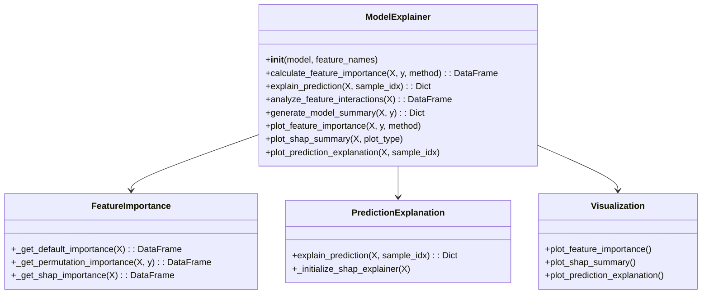

# StockSchool 1.17 综合优化建议

## 一、优化概述

基于对现有1.17版本规划文件（1.1.7b规划.md、1.1.7c规划.md、1.17a兼容.md）的分析，结合代码实现现状，我们提出以下综合优化建议。这些建议旨在解决当前规划中存在的问题，提升系统可解释性、性能和可维护性。

## 二、核心优化方向

### 1. 代码结构优化

```
# 建议的代码结构
src/strategy/
├── model_explainer.py          # 模型解释器主模块
├── shap_explainer.py           # SHAP专门模块
├── permutation_explainer.py    # 排列重要性模块
├── visualization.py            # 可视化模块
└── gpu_utils.py                # GPU工具函数模块
```



- **实现完整的`ModelExplainer`类**：支持多种解释方法，包括默认特征重要性、排列重要性和SHAP值计算
- **完成`gpu_utils.py`**：包含GPU内存监控、动态批量大小调整等功能
- **模块化重构**：将不同解释方法分离到专门的模块中，提高代码可维护性
- **扩展模型支持**：增加对深度学习模型的LIME解释方法支持
- **SHAP解释器优化**：针对不同模型类型选择合适的解释器，包含显存溢出处理
- **特征重要性计算优化**：支持分批处理大型数据集

### 2. 配置管理优化

```yaml
# config.yml 建议增加的配置项
feature_params:
  use_cuda: true
  shap_batch_size: 500
  shap_background_samples: 100
  max_gpu_memory: 20480
  gpu_oom_retry: 3
  fallback_to_cpu: true
  shap_visualization: true
  cache_explanations: true
  cache_dir: ./cache/explanations
  max_cache_size: 1000
  explanation_timeout: 3600
  shap_max_objects: 10000
  shap_parallel: false
  cuda_device: 0
  memory_threshold: 0.8
  batch_reduction_factor: 0.5
  max_batch_retries: 5
  windows_cuda_workaround: true
  model_explainer_type: auto
```

- **完善GPU相关配置**：增加更多GPU内存管理和监控参数
- **增加缓存机制配置**：支持解释结果缓存，提高重复查询性能
- **可视化配置**：添加SHAP可视化相关配置选项
- **Windows环境适配**：增加Windows特定的CUDA配置选项
- **动态批量调整**：添加批量减少因子和最大重试次数配置
- **资源阈值设置**：增加内存阈值配置，用于触发降级机制
- **模型解释器选择**：支持自动选择适合不同模型类型的解释器

### 3. 性能与兼容性优化

- **PyTorch版本升级**：升级到1.13.1+cu117版本，并验证与SHAP的兼容性
- **动态批量大小调整**：实现根据GPU内存情况自动调整批量大小的机制，包含初始批量估算和渐进式调整
- **GPU内存监控**：添加GPU内存使用监控和预警系统，使用nvidia-smi监控GPU利用率
- **SHAP算法优化**：
  - 使用TreeSHAP等近似算法提高树模型解释性能
  - 对大型数据集实施分批处理
  - 对背景样本进行智能采样
- **Windows环境优化**：
  - 针对Windows环境下CUDA配置进行专门测试和优化
  - 实现Windows特定的内存管理策略
  - 提供详细的Windows环境配置指南
- **降级机制**：当GPU不可用或内存不足时自动切换到CPU
- **依赖管理**：
  - 创建requirements.txt文件，明确指定依赖版本
  - 增加依赖版本冲突检测机制
  - 对关键依赖项进行版本锁定

### 4. 错误处理与健壮性

- **完善异常处理**：
  - 增加详细的错误日志和异常处理机制
  - 实现自定义异常类层次结构
  - 添加异常分类和错误码系统
- **CUDA显存溢出处理**：
  - 实现多级重试策略和资源释放机制
  - 添加渐进式批量减少策略
  - 增加OOM错误预警和自动清理机制
- **依赖版本检查**：
  - 在初始化时自动检查关键依赖的版本兼容性
  - 对不兼容版本提供明确的错误信息和升级建议
  - 添加依赖版本冲突解决策略
- **数据验证**：
  - 增加输入数据格式和类型验证
  - 实现数据质量检查和异常值检测
  - 添加数据预处理错误处理机制
- **资源管理**：
  - 实现GPU内存自动清理机制
  - 添加资源使用监控和预警
  - 优化资源分配策略，避免内存泄漏

### 5. 测试与验证策略

- **单元测试**：
  - 为每个模块编写详细的单元测试
  - 实现测试覆盖率目标≥80%
  - 增加对边缘情况的测试
- **集成测试**：
  - 测试模块间的交互
  - 验证完整工作流程
  - 测试不同配置组合
- **性能测试**：
  - 按照不同数据规模进行性能测试，建立基准指标
  - 实现SHAP计算<60秒的性能目标
  - 测试不同GPU型号下的性能表现
- **GPU内存测试**：
  - 添加GPU内存使用监控测试
  - 测试显存溢出处理机制
  - 验证动态批量调整效果
- **异常测试**：
  - 增加异常情况处理测试
  - 测试错误恢复机制
  - 验证降级策略有效性
- **兼容性测试**：
  - 验证在不同操作系统(Windows、Linux)下的表现
  - 测试不同硬件配置的兼容性
  - 验证不同PyTorch版本的兼容性
- **Windows环境专项测试**：
  - 针对Windows特有的CUDA配置问题进行测试
  - 验证Windows内存管理策略有效性
  - 测试Windows特定的错误处理机制

## 三、实施路径建议

### 1. 第一阶段：环境准备与基础完善（已完成）

1. **环境验证与准备**
   - 验证CUDA安装和可用性
   - 安装依赖包，创建requirements.txt
   - 配置开发环境，确保PyTorch 1.13.1+cu117与SHAP兼容性

2. **核心模块实现**
   - 完成`gpu_utils.py`模块的实现，包含以下功能：
     - GPU可用性检测
     - 动态批量大小计算
     - GPU内存监控
     - 自动降级策略
   - 重构`model_explainer.py`，实现模块化设计
   - 实现基础测试框架

### 2. 第二阶段：性能优化（当前阶段）

1. **动态批量大小调整机制**
   - 实现基于GPU内存的初始批量估算
   - 开发渐进式批量调整算法
   - 测试不同场景下的调整效果

2. **GPU内存监控和预警系统**
   - 集成nvidia-smi监控功能
   - 实现内存使用预警机制
   - 开发自动清理策略

3. **SHAP计算性能优化**
   - 针对树模型实现TreeSHAP算法
   - 开发智能分批处理机制
   - 优化背景样本选择策略

### 3. 第三阶段：功能完善与测试验证

1. **ModelExplainer功能完善**
   - 完成所有解释方法的实现
   - 开发可视化功能
   - 实现缓存机制

2. **测试与验证**
   - 编写并运行单元测试和集成测试
   - 进行全面的性能测试和基准测试
   - 验证在不同操作系统和硬件配置下的兼容性
   - 进行Windows环境专项测试

3. **文档与部署**
   - 编写详细的API文档
   - 创建用户手册
   - 准备部署包

### Git提交规范
- 格式：`[类型](范围): 描述`
- 类型：feat(新功能), fix(修复), docs(文档), style(格式), refactor(重构), test(测试), chore(其他)
- 示例：`feat(gpu_utils): 添加GPU内存监控功能`
- 每次提交只包含一个功能点或修复

## 四、风险评估与应对

| 风险项 | 风险等级 | 应对措施 |
|--------|----------|----------|
| 依赖版本兼容性 | ⚠️ 中 | 提前验证PyTorch与SHAP版本兼容性，准备降级方案 |
| GPU内存溢出 | ⚠️ 高 | 实现动态批量大小调整和自动降级机制 |
| Windows环境配置 | ⚠️ 中 | 提供详细的Windows环境配置指南，增加专门测试 |
| 性能目标未达标 | ⚠️ 中 | 设定阶段性性能目标，逐步优化 |

## 五、总结

1.17版本的规划是合理且必要的，它将显著提升系统的可解释性和实用性。通过实施上述优化建议，可以有效解决当前规划中存在的问题，确保版本目标的顺利实现。

建议优先完成第一阶段的任务，特别是`gpu_utils.py`模块的实现和PyTorch版本兼容性验证，为后续优化奠定基础。