# 系统知识图谱

## 实体列表

### 代码文件实体
| 名称 | 类型 | 观察结果 |
| src/strategy/evaluation.py | File | 策略评估器模块，实现StrategyEvaluator类；提供收益率、夏普比率、最大回撤等风险指标计算；支持年化收益、波动率、信息比率等评估指标；依赖config_loader获取配置参数 |
| src/strategy/model_explainer.py | File | 模型解释器模块，实现ModelExplainer类；提供特征重要性计算（默认、排列、SHAP三种方法）；支持单个预测结果解释和可视化；依赖config_loader和shap库进行模型解释 |
| src/monitoring/performance.py | File | 系统性能监控模块，包含SystemMonitor类；收集CPU、内存、磁盘和网络指标；依赖psutil库进行系统信息采集；支持指标历史记录和摘要统计 |
| src/utils/profiler.py | File | 性能剖析工具，实现PerformanceProfiler类；分析factor_engine和training_pipeline性能；使用cProfile进行代码性能分析；生成函数耗时统计报告 |
| src/utils/retry.py | File | 提供幂等重试装饰器idempotent_retry；支持配置化重试次数和间隔时间；依赖config_loader获取配置参数；适用于网络请求和数据库操作 |
| src/utils/test_db.py | File | 测试数据库管理工具，实现TestDatabaseManager类；提供测试环境数据库连接和清理；支持表存在性检查和行数统计；依赖SQLAlchemy和环境变量配置 |
| src/features/feature_store.py | File | 特征商店模块，管理和存储量化因子特征；实现FeatureStore类，包含特征定义、特征值存储、特征组合、特征统计功能；支持特征注册、存储、标准化、百分位排名、Z分数计算；使用SQLAlchemy ORM定义特征表结构 |
| database_schema.sql | File | 数据库Schema设计文件，定义完整的PostgreSQL+TimescaleDB表结构；包含基础信息表(stock_basic, trade_calendar)、行情数据表(stock_daily, daily_basic, adj_factor)、财务数据表(income等)；使用TimescaleDB时序数据库扩展 |
| config.yml | File | 全局参数配置文件，使用YAML格式；定义因子计算参数(RSI、MACD、布林带等技术指标参数)、模型训练参数(LightGBM超参数)、策略评估参数(无风险利率、VaR置信水平等)、数据同步、监控、API、特征工程等参数 |
| run.py | File | 项目主入口文件，提供命令行接口；实现预检查(pre_flight_check)、数据库初始化(init_database)、API服务器启动等功能；包含Celery Worker启动功能；提供数据同步、健康检查、环境验证等功能 |
| src/tests/test_integration_pipeline.py | File | 端到端集成测试文件，测试完整数据同步->因子计算流程；实现黄金数据校验测试、数据库隔离测试、因子计算精确性验证；包含setup_test_database测试夹具，提供测试环境管理；使用pytest框架，测试策略评估器、因子引擎等核心功能 |
| Dockerfile | File | 容器化配置文件，定义StockSchool量化投研系统的Docker镜像构建过程；基于Python 3.11-slim镜像，包含系统依赖安装、Python依赖安装、应用代码复制等步骤；设置工作目录为/app，配置环境变量；安装gcc、g++、libpq-dev等系统依赖；使用uvicorn启动API服务器 |
| docker-compose.yml | File | Docker Compose编排文件，定义完整的StockSchool系统服务架构；包含PostgreSQL+TimescaleDB主数据库服务；包含独立的测试数据库服务(test_db)用于测试环境隔离；包含Redis缓存服务支持Celery消息队列；定义网络配置和健康检查机制 |
| .github/workflows/ci_pipeline.yml | File | GitHub Actions CI/CD流水线配置文件，定义持续集成和部署流程；触发条件：main分支的push和pull request事件；构建环境：Ubuntu-latest，Python 3.11；运行scripts/full_test_v1_1_6.py完整测试脚本；支持测试日志上传artifact |
| scripts/clear_database.py | File | 数据库清理脚本，用于清空核心数据表确保测试从干净状态开始；实现DatabaseCleaner类，提供系统化的数据库清理功能；定义核心数据表列表和可选清理表；提供表存在性检查、行数统计、安全清空等功能；使用SQLAlchemy连接数据库，支持事务操作 |
| src/data/tushare_sync.py | File | 实现TushareSynchronizer类，同步股票基本信息、交易日历、日线数据，使用SQLAlchemy操作数据库 |
| src/data/akshare_sync.py | File | 实现AkShareSynchronizer类，同步市场情绪、资金流向、北向资金数据，调用akshare库获取数据 |
| src/compute/tasks.py | File | 实现Celery任务调度，包含数据同步、因子计算等定时任务，支持多队列路由和任务重试机制，调用tushare_sync.py中的同步方法 |
| src/ai/training_pipeline.py | File | 实现ModelTrainingPipeline类，支持多种机器学习模型训练，包含数据准备、模型训练和评估功能，使用lightgbm库进行模型训练 |
| src/ai/prediction.py | File | AI预测模块，包含StockPredictor类，提供模型加载、因子获取和预测数据准备功能，依赖utils.db、compute.factor_engine和joblib库 |
| src/api/main.py | File | FastAPI应用入口文件，提供股票数据、因子和策略评估API接口，引用tushare_sync和factor_engine模块 |
| src/check_stocks.py | File | 股票数据检查脚本，验证stock_basic表数据完整性，使用utils.db模块连接数据库 |
| src/compute/factor_engine.py | File | 因子计算引擎，提供股票数据获取和技术因子计算功能，依赖compute.indicators模块 |
| src/compute/indicators.py | File | 技术指标计算模块，包含SMA、EMA、RSI等技术指标实现，提供TechnicalIndicators类 |
| src/compute/processing.py | File | 因子预处理模块，实现因子去极值、标准化和中性化功能，使用sklearn库进行数据处理 |
| src/compute/quality.py | File | 数据质量检查模块，提供异常值检测和数据清洗功能，包含validate_price_data和calculate_data_quality_score函数 |
| src/monitoring/logger.py | File | 日志和告警管理模块，提供日志配置和多渠道告警功能，包含EmailNotifier和WebhookNotifier类 |
| src/monitoring/alerts.py | File | 告警系统模块，包含AlertRule、Alert、MetricCollector和AlertStorage核心类 |
| src/utils/config_loader.py | File | 配置管理模块，实现单例模式的Config类管理全局配置 |
| src/utils/db.py | File | 数据库管理模块，实现DatabaseManager类管理数据库连接和操作 |
| src/strategy/ai_model.py | File | 实现LightGBM模型训练，包含特征工程和模型评估，支持多种机器学习算法 |
| run_daily_workflow.py | File | 每日工作流执行脚本 |
| src/tests/test_ai_model.py | File | ai_model.py的单元测试 |
| src/tests/test_alerts.py | File | alerts.py的单元测试 |
| src/tests/test_config.py | File | config_loader.py的单元测试 |
| src/tests/test_database.py | File | db.py的单元测试 |
| src/tests/test_tushare_sync.py | File | tushare_sync.py的单元测试 |

### 外部依赖实体
| 名称 | 类型 | 观察结果 |
|------|------|----------|
| Celery | 外部依赖实体 | 用于任务队列管理，实现数据同步和因子计算的异步任务 |
| LightGBM | 外部依赖实体 | 用于训练预测模型，在training_pipeline.py中使用 |
| lightgbm | 外部库 | 机器学习框架，用于回归和分类任务，在src/ai/training_pipeline.py中导入，支持梯度提升决策树算法 |
| akshare | 外部库 | 金融数据接口库，提供市场情绪和资金流向数据 |
| joblib | 外部库 | Python序列化库，用于模型保存和加载 |
| sklearn | 外部库 | 机器学习库，提供数据预处理和模型评估功能 |
| SQLAlchemy | 外部库 | ORM框架，用于数据库交互和查询构建 |
| shap | 外部库 | 模型解释库，用于计算SHAP值和特征重要性，支持多种机器学习模型的解释 |
| psutil | 外部库 | 系统监控库，用于获取CPU、内存、磁盘和网络信息 |
| cProfile | 外部库 | Python性能分析工具，用于代码性能剖析 |
| matplotlib | 外部库 | Python绘图库，用于数据可视化 |
| PostgreSQL | 数据库 | 开源关系型数据库，存储股票基础信息、行情数据、财务数据等；database_schema.sql定义完整表结构；feature_store.py使用SQLAlchemy ORM操作数据库 |
| TimescaleDB | 数据库 | PostgreSQL时序数据库扩展，优化时序数据存储和查询；database_schema.sql使用TimescaleDB扩展创建超表(hypertable)存储股票日线数据 |
| YAML | 库 | 配置文件解析库，用于解析config.yml全局配置文件；支持复杂配置结构和环境变量替换 |
| pytest | 库 | Python测试框架，用于编写和运行集成测试；test_integration_pipeline.py使用pytest框架进行端到端测试验证 |
| Redis | 库 | 开源内存数据结构存储系统，用作数据库、缓存和消息代理；在docker-compose.yml中定义为独立服务，支持Celery消息队列；配置持久化存储和数据卷挂载 |
| requirements.txt | 文件 | Python项目依赖配置文件，定义所有必需的第三方库版本；包含数据科学库、Web框架、数据库连接、机器学习、数据获取等核心依赖；被Dockerfile和CI/CD流程使用 |

### 数据库实体
| 名称 | 类型 | 观察结果 |
|------|------|----------|
| financial_reports表 | 代码元素实体 | 存储利润表、资产负债表、现金流量表数据，按stock_code+end_date建立复合索引 |
| financial_reports.sql | 数据库表 | 位于schema/financial目录，包含id、ts_code、ann_date等字段，使用UUID主键，包含审计相关字段和时间戳 |
| financial_reports | database_table | 包含财务指标数据，有UUID主键，包含审计字段created_at和updated_at |

## 关系列表
| 源实体 | 目标实体 | 关系类型 |
| src/strategy/evaluation.py | src/utils/config_loader.py | imports |
| src/strategy/evaluation.py | numpy | imports |
| src/strategy/evaluation.py | pandas | imports |
| src/strategy/evaluation.py | matplotlib | imports |
| src/strategy/model_explainer.py | src/utils/config_loader.py | imports |
| src/strategy/model_explainer.py | shap | imports |
| src/strategy/model_explainer.py | sklearn | imports |
| src/strategy/model_explainer.py | src/ai/training_pipeline.py | imports |
| src/monitoring/performance.py | psutil | imports |
| src/utils/profiler.py | cProfile | imports |
| src/utils/retry.py | src/utils/config_loader.py | imports |
| src/utils/test_db.py | SQLAlchemy | imports |
| src/utils/test_db.py | src/utils/retry.py | imports |
| src/monitoring/performance.py | src/utils/profiler.py | imports |
| src/features/feature_store.py | src/utils/config_loader.py | imports |
| src/features/feature_store.py | PostgreSQL | connects to |
| config.yml | YAML | parsed by |
| run.py | src/utils/config_loader.py | imports |
| run.py | src/utils/db.py | imports |
| src/tests/test_integration_pipeline.py | pytest | uses framework |
| src/tests/test_integration_pipeline.py | src/compute/factor_engine.py | tests |
| src/tests/test_integration_pipeline.py | src/data/tushare_sync.py | tests |
| database_schema.sql | PostgreSQL | defines schema for |
| database_schema.sql | TimescaleDB | uses extension |
| src/compute/tasks.py | src/data/tushare_sync.py | imports |
| src/ai/training_pipeline.py | lightgbm | imports |
| src/data/akshare_sync.py | akshare | imports |
| src/ai/training_pipeline.py | src/strategy/ai_model.py | imports |
| src/compute/tasks.py | src/data/akshare_sync.py | imports |
| src/api/main.py | src/data/tushare_sync.py | imports |
| src/api/main.py | src/compute/factor_engine.py | imports |
| src/ai/prediction.py | src/compute/factor_engine.py | imports |
| src/ai/prediction.py | joblib | imports |
| src/compute/processing.py | sklearn | imports |
| src/features/feature_store.py | SQLAlchemy | imports |
| src/monitoring/alerts.py | pandas | imports |
| src/monitoring/alerts.py | numpy | imports |
| src/monitoring/alerts.py | sqlite3 | imports |
| src/monitoring/logger.py | smtplib | imports |
| src/monitoring/logger.py | requests | imports |
| src/utils/db.py | SQLAlchemy | imports |
| src/monitoring/alerts.py | src/utils/config_loader.py | imports |
| src/monitoring/logger.py | src/utils/config_loader.py | imports |
| src/utils/db.py | src/utils/config_loader.py | imports |

## 实体关系图

```mermaid
graph TD
    subgraph a[src]
        subgraph src/ai
            A[training_pipeline.py]
            B[prediction.py]
        end
        subgraph src/api
            C[main.py]
        end
        subgraph src/compute
            D[factor_engine.py]
            E[indicators.py]
            F[processing.py]
            G[quality.py]
            H[tasks.py]
        end
        subgraph src/data
            I[akshare_sync.py]
            J[tushare_sync.py]
        end
        subgraph src/features
            K[feature_store.py]
        end
        subgraph src/monitoring
            L[alerts.py]
            M[logger.py]
            N[performance.py]
        end
        subgraph src/strategy
            O[ai_model.py]
            P[evaluation.py]
            Q[model_explainer.py]
        end
        subgraph src/tests
            R[test_ai_model.py]
            S[test_alerts.py]
            T[test_config.py]
            U[test_database.py]
            V[test_tushare_sync.py]
            W[test_integration_pipeline.py]
        end
        subgraph src/utils
            X[config_loader.py]
            Y[db.py]
            Z[profiler.py]
            AA[retry.py]
            AB[test_db.py]
        end
        AC[check_stocks.py]
    end
    subgraph root
        AD[run.py]
        AE[run_daily_workflow.py]
        AF[config.yml]
        AG[database_schema.sql]
        AH[Dockerfile]
        AI[docker-compose.yml]
    end
    
    subgraph 外部依赖
        N[numpy]
        O[pandas]
        P[scikit-learn]
        Q[lightgbm]
        R[tushare]
        S[sqlalchemy]
        T[celery]
        U[fastapi]
        V[uvicorn]
        W[shap]
        X[psutil]
        Y[cProfile]
        Z[matplotlib]
        PG[(PostgreSQL)]
        TS[TimescaleDB]
        YL[YAML]
        PT[pytest]
        RED[(Redis)]
        REQ[requirements.txt]
    end
    
    subgraph 数据库
        DB[(PostgreSQL)]
    end
    
    A -->|读取配置| CY
    CY -->|使用| YL
    B -->|连接| DB
    C -->|使用| A
    C -->|使用| B
    C -->|使用| N
    C -->|使用| O
    D -->|使用| A
    D -->|使用| B
    D -->|使用| R
    E -->|使用| A
    E -->|使用| B
    E -->|使用| P
    E -->|使用| Q
    F -->|使用| B
    G -->|使用| A
    G -->|使用| T
    H -->|使用| A
    H -->|使用| N
    H -->|使用| O
    H -->|使用| Z
    I -->|使用| A
    I -->|使用| W
    I -->|使用| P
    I -->|调用| E
    J -->|使用| X
    K -->|使用| Y
    K -->|分析| C
    K -->|分析| E
    L -->|使用| A
    M -->|使用| L
    M -->|使用| B
    FS -->|使用| A
    FS -->|使用| PG
    DS -->|定义| PG
    DS -->|使用| TS
    RU -->|使用| A
    RU -->|使用| B
    TI -->|使用| PT
    TI -->|测试| C
    TI -->|测试| D
    
    DF -->|uses| REQ
    DF -->|starts| RU
    DC -->|uses| DF
    DC -->|uses| DS
    DC -->|defines| PG
    DC -->|defines| RED
    CI -->|runs| CD
    CI -->|uses| REQ
    CD -->|uses| B
    CD -->|uses| A
```

## 实体详情
### tushare_sync.py
- **类型**: 代码元素实体
- **观察结果**: 负责同步Tushare财务数据和指标数据，包含update_financial_data和update_daily_basic_data方法
- **创建时间**: 2025-07-30T05:45:27.188Z
- **版本**: 1

### akshare_sync.py
- **类型**: 代码元素实体
- **观察结果**: 负责同步Akshare情绪数据，包含update_sentiment_data方法
- **创建时间**: 2025-07-30T05:45:27.189Z
- **版本**: 1

### financial_reports表
- **类型**: 代码元素实体
- **观察结果**: 存储利润表、资产负债表、现金流量表数据，按stock_code+end_date建立复合索引
- **创建时间**: 2025-07-30T05:45:27.189Z
- **版本**: 1

### Celery
- **类型**: 外部依赖实体
- **观察结果**: 用于任务队列管理，实现数据同步和因子计算的异步任务
- **创建时间**: 2025-07-30T05:45:27.189Z
- **版本**: 1

### LightGBM
- **类型**: 外部依赖实体
- **观察结果**: 用于训练预测模型，在training_pipeline.py中使用
- **创建时间**: 2025-07-30T05:45:27.189Z
- **版本**: 1